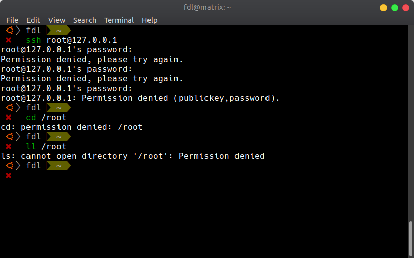
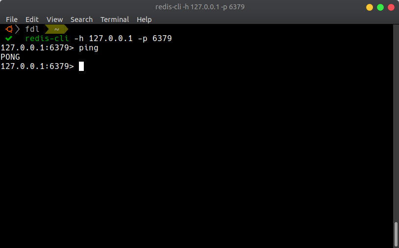
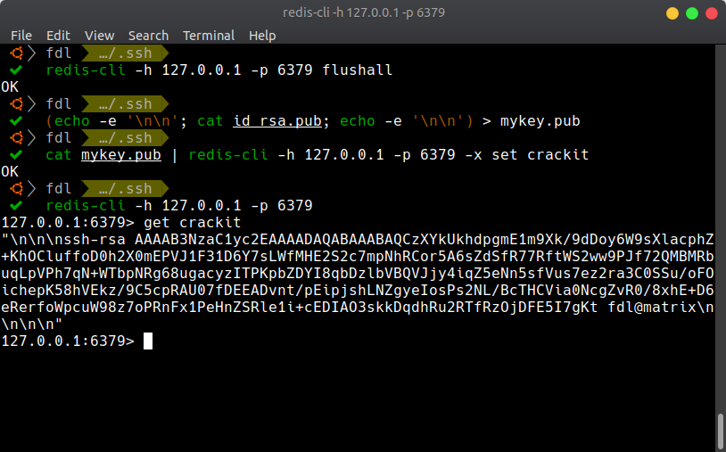
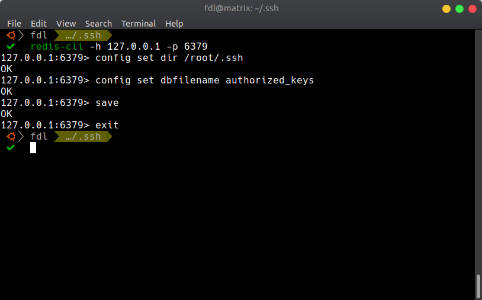
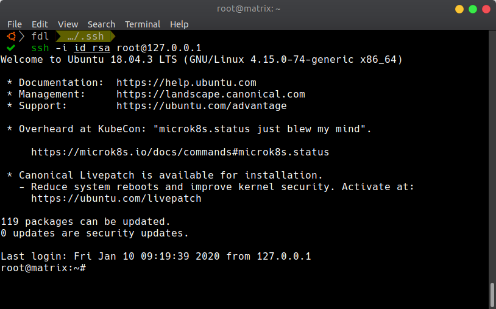
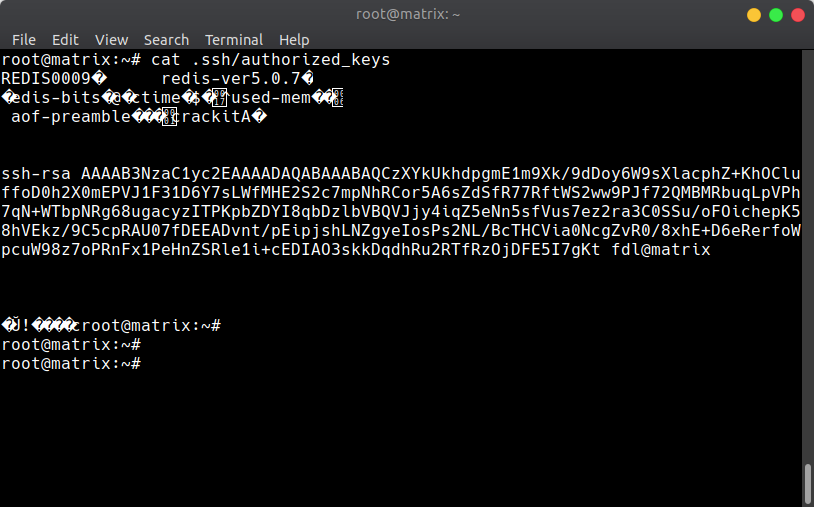

**Translator: [natsunoyoru97](https://github.com/natsunoyoru97)**

**Author: [labuladong](https://github.com/labuladong)**

All right, now my article also becomes a clickbait. How can I have my server attacked since I'm always being cautious?

I talked to my friend yesterday. He said one day he found **ALL** of his data **IS LOST** with only the key pair left on one of his cloud servers which ran the Redis database, in which the value looks like a string of the RSA public key. He thought he has deleted the database, but fortunately, there is nothing important in his server so he doesn't pay attention to this.

I also know that he ran an open-source program which is too old to maintain. His Redis is in the old version and he is not familiar with the Linux operation. I am sure that his server has been under an attack. It also makes me think about someone who doesn't pay attention to system permissions, firewall and data protection, so here I will explain the reason behind and how to prevent such things happen.

P.S. Such an attack doesn't work anymore because the updated version of Redis adds the protect mode, which is safer. We can only simulate the attack on the local.

### How Did It Go?

This attack was in 2015, in which Redis was poor in security. The security of the database only depended on SREs. There are thousands of nodes was attacked and the weird things happened like mentioned above. All data was emptied with only one key called `crackit` left, and the value looks like the string of the RSA public key.

It came out that the hackers applied dynamic configuration and persistence, and write their RSA public keys into `/root/.ssh/authored_keys` in the victims' computers, so they can use the private key to log in the root of the servers then invade the systems. 

The servers have been attacked are poor in security:

1. The port of Redis is in default and can be visited via the public internet.

2. No password in Redis.

3. The Redis process is started by the user.

ANY of these points make the server vulnerable, and it is lethal when added on. Despite your system contains the public key of others, it is a big loss if your database were emptied by the malicious operation. So what are the steps to do such an attack? I'll show you on my local loopback address.

### Performing on Local

The default port of Redis is 6379, and we set it receives the connection from NIC 127.0.0.1, so I can connect to Redis on local to simulate the scenario that Redis can be visited from the public internet.

Now I am the ordinary user named fdl, and I want to log in the root user via ssh. I need the password but I don't know so I can't log in.

I can also use the RSA key pair to log in despite password, but I have to store the public key to the home directory in root `/root/.ssh/authored_keys`. We know the permission of the `/root` directory doesn't allow any other user to access, read or write:

But I find I can access Redis:

If Redis is running by root, I can operate Redis to write my public key into the home directory of the root file. There is one way to do persistence in Redis is to generate the RDB file which contains source data.

Now I have an evil wicked grin. First, I empty the data in Redis, and then I write my RSA public key into the database. I also add line breaks in the start and the end to avoid the RDB file to damage the string of the public key:

And make Redis to store the generated data to the file `authored_keys` in the directory `/root/.ssh/`:

Now the home directory of root contains our RSA public key, and we can log in the root by the key pair:

Take a look at the public key written into the root home directory:

Maybe the messy code is encoded in the GDB file, but the public key is completely stored and oddly the ssh login program should verify the public key surrounded by the messy code!

Now I own the root privilege and can do anything I would like to do …

### Lessons Learnt

It is nearly impossible to be the victim of such kind of attack (the updated version of Redis is not available when there is no password in default), but everyone is supposed to be vigilant about the system security.

We buy a cloud server with a simple configuration. We often omit to configure the firewall and to set a strong password of the database. These are definitely not good behaviors.

Now the computer system is more and more completed and every mature program is maintained by the elites. It is supposed to be technically flawless, so the only possible problem is in the users.

If there is someone's QQ (A popular social media platform in China) account is hacked, I believe the hackers won't hack in the database of Tencent (The company which owns QQ), it must be the owner is careless and put the account name and the password into a fraud website. I rarely see someone's Wechat (Also a popular social media platform in China) account is hacked, maybe it is because Wechat uses the QRcode to login instead of the password. Probably it is a consideration of security, Wechat supplies online payment after all.

It is easy for geeks to identify the fraud mentioned above by looking at the url and analyzing the network packets by browsers. But believe it or not, normies have no idea about identifying the fraud website. Out of my expectation, we are in the year 2020 but there is still someone trying to find this leak and someone still be the victim …

Turn back to the usage of Redis, its official site has listed the advice to protect your system. Let me do the brief summary:

1. Run an unprivileged Redis user that is only used for this purpose. Strong passwords must be set to prevent the crack by brute force.

2. The Redis port should be firewalled to prevent access from the outside. So does the config file, it also should be properly configured.

3. Disable commands in Redis or to rename them into an unguessable name, so that normal clients are limited to a specified set of commands.

### See Also

[Redis Security](https://redis.io/topics/security)

RedisWannaMine attack in 2018:

[RedisWannaMine Unveiled: New Cryptojacking Attack Powered by Redis and NSA Exploits](https://www.imperva.com/blog/rediswannamine-new-redis-nsa-powered-cryptojacking-attack/)

[New research shows 75% of ‘open’ Redis servers infected](https://www.imperva.com/blog/new-research-shows-75-of-open-redis-servers-infected/)
