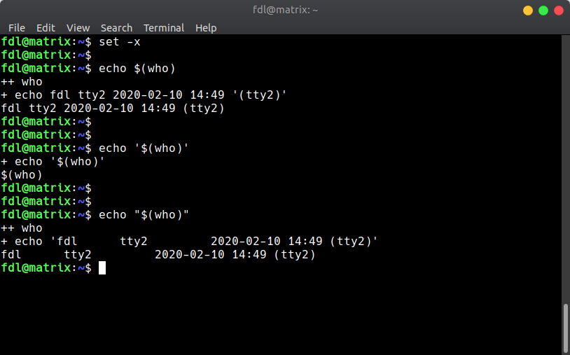

<<<<<<< Updated upstream
# Things you must know about Linux Shell 

**Translator: [Tianhao Zhou](https://github.com/tianhaoz95)**

**Author: [labuladong](https://github.com/labuladong)**

Although Windows has advantages over Linux in terms of graphical interfaces, due to Windows' limited support for terminal scripts, I still prefer Linux. Using terminal may, at first, seem counterintuitive, but with more familiarity, it can become a timer saver over graphical interfaces.

**Instead of demonstrating the usage of Linux terminal, the post focuses on the basic yet confusing gotchas:**

1. The difference between standard input and variables.

2. Why processes running on the background exit upon terminal termination?
=======
我个人很喜欢使用 Linux 系统，虽然说 Windows 的图形化界面做的确实比 Linux 好，但是对脚本的支持太差了。一开始有点不习惯命令行操作，但是熟悉了之后反而发现移动鼠标点点点才是浪费时间的罪魁祸首。。。
>>>>>>> Stashed changes

3. Single-quotes vs. double-quotes.

4. How does `sudo` make commands `not found`?

### 1. The difference between standard input and variables

The difference between standard input and variables boils down to the question of when to use pipe `|` and redirecting `>`, `<` vs. when to use variables `$`.

For example, if a shell script to automate ethernet connection locates in my home directory:

```shell
$ where connect.sh
/home/fdl/bin/connect.sh
```

To remove the script with minimal effort, I tried:

```shell
$ where connect.sh | rm
```

However, the command above is incorrect. The proper way is:

```shell
$ rm $(where connect.sh)
```

The former attempts to pipe the output from `where` into the standard input of `rm`, whereas the latter passes it in as an variable.

**Typically standard inputs appear in programming languages as `scanf` and `readline`; Variables refer to the literal arguments, `args`, the `main` program consumes.**

As mentioned in「Linux file descriptor」, Pipe and redirecting aim to use data as standard input. By contrast, `$(cmd)` reads the output from `cmd` as variables.

Revisiting the previous example, the source code of `rm` will certainly prefer receiving variable arguments over standard input to remove a file. In comparison, the `cat` command accepts both standard input and variables.

```shell
$ cat filename
...file text...

$ cat < filename
...file text...

$ echo 'hello world' | cat
hello world
```

**If a command can clog the terminal, then it accepts standard input and vice versa.** For example, running "cat" without arguments will suspend (intentionally clog) the terminal to wait for user input and print back the same content.

### 2. Why processes running on the background exit upon terminal termination?

For example, we want to spin up a Django web server on a remote server:

```shell
$ python manager.py runserver 0.0.0.0
Listening on 0.0.0.0:8080...
```

With the server up and running, we can test it through the server's IP address. However, at the same time, the terminal will suspend, not responding to any input, until it detects `Ctrl-C`/`Ctrl-/` and kills the Python process.

With a tailing `&`, the command won't clog the terminal and will continue to respond to incoming commands. However, the website becomes unavailable once you log out of the server.

To keep the web service available after logging out of the server, consider using this command `(cmd &)`:

```shell
$ (python manager.py runserver 0.0.0.0 &)
Listening on 0.0.0.0:8080...

$ logout
```

**Under the hood:**：

Every terminal is a shell process, and it forks itself to provide child processes to execute commands. Usually, the shell process clogs while waiting for the child processes to exit, not accepting new commands. With a tailing `&`, the shell process allows issuing new commands. However, when the shell process exits upon the termination of the terminal window, all its child processes will exit.

Nevertheless, commands like `(cmd &)` move the process under `systemd`, an OS guarded process that prevents the process from exiting when we close the current terminal.

An alternative approach to background execution is:

```shell
$ nohup some_cmd &
```

<<<<<<< Updated upstream
<<<<<<< Updated upstream:技术/linuxshell.md
`nohup`命令也是类似的原理，不过通过我的测试，还是`(cmd &)`这种形式更加稳定。
=======
`nohub` functions similarly, but with extensive testing, `(cmd &)` appears to be more stable.
>>>>>>> Stashed changes:common_knowledge/linuxshell.md
=======
`nohup`命令也是类似的原理，不过通过我的测试，还是`(cmd &)`这种形式更加稳定。
>>>>>>> Stashed changes

### 3. Single-quotes vs. double-quotes

Shells with different flavors behave differently, but with one invariant: **for `$`，`(`，`)`, single-quote won't trigger evaluation, but double-quote will.**

The shell behavior is observable through `set -x`, which triggers playback:



As shown above, `echo $(cmd)` and `echo "$(cmd)"` differ slightly. Look closely, double-quote adds single-quote after evaluation whereas single-quote doesn't.

**As a result, if the literal value from `$` contains space, we should use double-quote to avoid errors.**

### 4. How does `sudo` make commands `not found`?

<<<<<<< Updated upstream
Under certain situations, a command that non-privileged users can execute becomes "not found" when privileged users try to run with `sudo`:
=======
有时候我们普通用户可以用的命令，用`sudo`加权限之后却报错 command not found：
>>>>>>> Stashed changes

```shell
$ connect.sh
network-manager: Permission denied

$ sudo connect.sh
sudo: command not found
```

<<<<<<< Updated upstream
The root cause is that the `connect.sh` script only exists in the user's environment variables.
=======
原因在于，`connect.sh`这个脚本仅存在于该用户的环境变量中：
>>>>>>> Stashed changes

```shell
$ where connect.sh 
/home/fdl/bin/connect.sh
```

<<<<<<< Updated upstream
**When prefixing `sudo`, we tell the OS that the `sudoer` is executing the command, so the OS will search the environment variables of the `sudoer`(defined in `/etc/sudoer`)** where the `connect.sh` script doesn't exist.

<<<<<<< Updated upstream:技术/linuxshell.md
解决方法是使用脚本文件的绝对路径，而不是用脚本的相对路径：
=======
The solution is to locate the script with a path instead of a name:
>>>>>>> Stashed changes:common_knowledge/linuxshell.md
=======
**当使用`sudo`时，系统认为是 root 用户在执行命令，所以会去搜索 root 用户的环境变量**，而这个脚本在 root 的环境变量目录中当然是找不到的。

解决方法是使用脚本文件的绝对路径，而不是用脚本的相对路径：
>>>>>>> Stashed changes

```shell
$ sudo /home/fdl/bin/connect.sh
```
<<<<<<< Updated upstream:技术/linuxshell.md

坚持原创高质量文章，致力于把算法问题讲清楚，欢迎关注我的公众号 labuladong 获取最新文章：


[上一篇：一文看懂 session 和 cookie](../技术/session和cookie.md)

[下一篇：加密算法的前身今世](../技术/密码技术.md)

[目录](../README.md#目录)
<<<<<<< Updated upstream
=======
>>>>>>> Stashed changes:common_knowledge/linuxshell.md
=======
>>>>>>> Stashed changes
